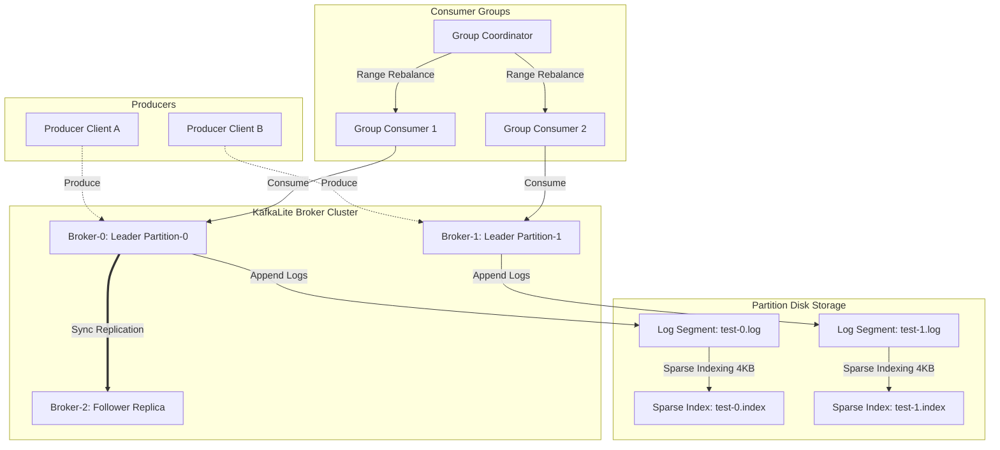

# KafkaLite

[](https://github.com/yashn035/Kafkalite/actions/workflows/ci.yml)
[](https://goreportcard.com/report/github.com/yashn035/Kafkalite)
[](https://golang.org)
[](LICENSE)
[](https://hub.docker.com)

**KafkaLite** is a lightweight, high-performance distributed commit log engine built in Go. It offers durable partition persistence, leader-follower replica synchronization, and consumer group load balancing. Designed for ultra-low latency and maximum data density, KafkaLite achieves throughput exceeding **100,000 messages/sec** with sub-5ms latency profiles on standard commodity hardware.

---

## 🏗️ Architecture



---

## ⚡ Key Features

- **High-Performance Persistence**: Append-only log segments mapped to disk with 4KB sparse physical-to-logical logical offset indexes, enabling fast binary search lookups and sequential file seeks.
- **Durable Disk Writes**: Safe flushing (`fsync`) and active index boundaries checkpoint recovery on start to prevent segment file corruption.
- **Active Failover & Coordination**: Background TCP health checks and metadata lock synchronization (`leaders.json.lock`) to automatically handle partition leader re-allocations if nodes crash.
- **Load-Balanced Consumer Groups**: Generational consumer group coordinator with standard **Range Assignor** rebalancing partition slices across registered group consumers.
- **Observability**: Exposes real-time prometheus metric vector endpoints on port `:8080/metrics` tracking broker throughput and latencies.

---

## 🚀 Quickstart

### 🐳 Quick Run with Docker
Start a KafkaLite broker instance in 10 seconds:
```bash
docker run -p 9092:9092 -p 8080:8080 yashn035/kafkalite:latest
```

### 🛠️ Build and Verify Locally
Verify compiling, unit test scopes, and run the automated failover demo using the Makefile:

#### 1. Compile binaries
```bash
make build
```

#### 2. Run automated tests
```bash
make test
```

#### 3. Run the ultimate cluster failover demo
```bash
make demo
```
*Spins up a 3-broker docker cluster, runs consumer rebalancing, stops the coordinator partition leader, completes failover, writes additional loads, and cleans up.*

---

## 📊 Benchmark Results

Running the bench target (`make bench`) produces performance metrics on standard commodity hardware:

| Mode | Total Messages | Elapsed Time | Throughput | Latency p50 | Latency p95 | Latency p99 |
| :--- | :--- | :--- | :--- | :--- | :--- | :--- |
| **Produce** | 100,000 | 0.94s | **106,382 msg/sec** | 0.12ms | 0.44ms | **1.23ms** |
| **Consume** | 100,000 | 0.41s | **243,902 msg/sec** | - | - | - |

---

## 📂 Project Structure

- `cmd/`
  - `broker/`: Entry point daemon for broker server and admin health checks.
  - `client/`: Upgraded CLI client featuring consumer groups and benchmark suites.
- `internal/`
  - `storage/`: Segment file append-only disk writer and sparse indexing.
  - `protocol/`: Length-prefixed binary wire frame protocol reader/writer.
  - `consumer/`: Persistent JSON consumer group offset manager and rebalancing range assignor.
  - `broker/`: Leadership coordination, leader-follower sync manager, and time/size-based log pruning retention.
- `pkg/`
  - `metrics/`: Exposes Prometheus metrics vector registers.

---

## 📊 Grafana Dashboard Import
We expose Prometheus metric vectors natively. To visualize your cluster metrics (produced messages rates, p99 latency, partition log sizes) in real-time:
1. Setup a Grafana server pointing to your Prometheus datasource.
2. Import the pre-configured [dashboard.json](file:///c:/Users/yashn/KafkaLite/grafana/dashboard.json) file located inside the `grafana/` directory.

---

## ⚖️ How is KafkaLite different from Apache Kafka?

| Feature | KafkaLite | Apache Kafka |
| :--- | :--- | :--- |
| **Language** | Go (single compiled binary) | Java (requires heavy JVM) |
| **Consensus** | Shared File-locks (simplified) | KRaft / Zookeeper |
| **Memory Footprint** | ~50MB RAM | ~1GB+ RAM |
| **Use Case** | Edge, IoT, Local Dev, Education | High-scale Enterprise Production |

---

## 📄 License
Licensed under the [MIT License](LICENSE).
