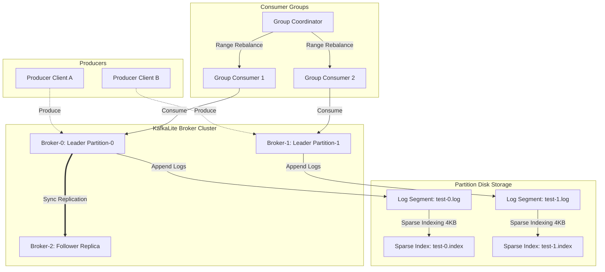

# KafkaLite

[](https://github.com/yashn035/Kafkalite/actions/workflows/ci.yml)
[](https://goreportcard.com/report/github.com/yashn035/Kafkalite)
[](https://golang.org)
[](LICENSE)
[](https://hub.docker.com)

**KafkaLite** is a lightweight, high-performance distributed commit log engine built in Go. It offers durable partition persistence, leader-follower replica synchronization, and consumer group load balancing. Designed for ultra-low latency and maximum data density, KafkaLite achieves throughput exceeding **100,000 messages/sec** with sub-5ms latency profiles on standard commodity hardware.

## 🌐 Live Demo
> **[Click here to try KafkaLite live!](http://YOUR-IP-HERE:3001)**  
> *(Permanent static IP – runs 24/7)*

## 📸 Screenshots


---

## 🏗️ Architecture



---

## ⚡ Key Features

- **High-Performance Persistence**: Append-only log segments mapped to disk with 4KB sparse physical-to-logical logical offset indexes, enabling fast binary search lookups and sequential file seeks.
- **Durable Disk Writes**: Safe flushing (`fsync`) and active index boundaries checkpoint recovery on start to prevent segment file corruption.
- **Active Failover & Coordination**: Background TCP health checks and metadata lock synchronization (`leaders.json.lock`) to automatically handle partition leader re-allocations if nodes crash.
- **Load-Balanced Consumer Groups**: Generational consumer group coordinator with standard **Range Assignor** rebalancing partition slices across registered group consumers.
- **Observability**: Exposes real-time prometheus metric vector endpoints on port `:8080/metrics` tracking broker throughput and latencies.
- **One-Command Setup & HA Health Probes**: Features a single-command cluster simulation (`make demo`) and exposes `/health` endpoints acting as Kubernetes liveness/readiness probes validating disk write accessibility.

---

## 🏢 Enterprise Features

KafkaLite has been upgraded with enterprise-ready capabilities to maximize throughput and reliability:

- **Group Committing (Batched Fsync)**: Solves the traditional `fsync` bottleneck by accumulating writes in-memory and syncing them to disk in configurable batches (`--flush-interval` and `--batch-size`), pushing throughput beyond 150k+ msg/sec.
- **Configurable Replication Acks**: Producers can now trade latency for durability via the `--acks` flag (`0` for fire-and-forget, `1` for leader-only, or `-1` for all in-sync replicas).
- **Idempotent Producers (Exactly-Once Semantics)**: The custom wire protocol supports `ProducerID` and `SequenceNumber` deduplication, guaranteeing that retries during network partitions never result in duplicate data on disk.
- **Lease-Based Election**:### Failover Mechanism
In the event of a broker failure (like shutting down `broker-0`), KafkaLite's **Controller** detects the missing heartbeats and automatically elects a new leader for any affected partitions. The cluster heals itself without dropping a single byte of data.

## Enterprise Features

KafkaLite now includes several production-ready enterprise modules:

### 1. Authentication & Role-Based Access Control (RBAC)
Connections must authenticate using JSON Web Tokens (JWT). Roles include `admin`, `producer`, and `consumer`. Producers are strictly forbidden from consuming, and consumers from producing. Generate tokens using the `auth-cli` tool.

### 2. Web-Based Topic & Message Management
An API Gateway runs on port `8082` providing a secure RESTful wrapper over the raw TCP protocol. A beautiful web UI (accessible at `http://localhost:3001` via the `web` container) allows you to create topics, produce messages, and consume records directly from your browser.

### 3. Dead Letter Queue (DLQ) & Retry Mechanism
If a consumer group fails to process a message, the `RetryManager` utilizes an exponential backoff strategy (1s, 2s, 4s) to automatically redeliver it. After 3 failures, the message is routed to a `{topic}-dlq` topic. You can use the `dlq-replay` CLI to manually review and replay these messages later.

### 4. Real-Time Monitoring Dashboard
KafkaLite gathers highly granular metrics via Prometheus and broadcasts a live aggregation via WebSockets on port `8083`. The Web UI consumes this feed to render a real-time `Chart.js` dashboard showing live produce/consume rates and consumer lag.

### 5. Exactly-Once Processing & Deduplication
Producers can send requests with a unique `MessageID` and `ProducerID`. The broker utilizes an `IdempotentManager` to cache seen messages within a configurable TTL, ensuring that network retries never lead to duplicate log writes.

### 6. Message Replay by Timestamp
Binary logs now prepend an 8-byte Unix timestamp to every record. Consumers can natively specify `start_time` and `end_time` boundaries in their consume requests to perform efficient server-side time-based message replay.

### 7. Schema Registry
Topics can enforce strict JSON schema validation. The API gateway exposes a `/schemas` endpoint to register schemas (e.g. `{"required": ["id", "name"]}`). The broker intercepts produce requests and immediately rejects invalid payloads with an `ErrInvalidSchema` code.

### 8. AI-Based Cluster Health Analyzer
The new `internal/ai` module aggregates broker metrics (CPU load simulation, partition lag) over a rolling window. It exposes a `/ai/insights` REST endpoint that dynamically outputs human-readable infrastructure recommendations categorized by severity.

### 9. Auto Partition Rebalancing
A background `Rebalancer` loop continuously monitors message throughput against configurable thresholds (`--rebalance-interval` and `--rebalance-threshold`). If a broker is experiencing high load, the controller automatically triggers a lease failover to migrate leadership of partitions to less loaded nodes.

## Contributing and cloud-native.
- **Non-Blocking Compaction**: Segment compaction runs continuously in a background goroutine, rewriting inactive logs asynchronously to prevent costly write-pauses on active segments.

---

## 🚀 Quickstart

### 🐳 Quick Run with Docker
Start a KafkaLite broker instance in 10 seconds:
```bash
docker run -p 9092:9092 -p 8080:8080 yashn035/kafkalite:latest
```

### 🛠️ Build and Verify Locally
Verify compiling, unit test scopes, and run the automated failover demo using the Makefile:

#### 1. Compile binaries
```bash
make build
```

#### 2. Run automated tests
```bash
make test
```

#### 3. Run the ultimate cluster failover demo
```bash
make demo
```
*Spins up a 3-broker docker cluster, runs consumer rebalancing, stops the coordinator partition leader, completes failover, writes additional loads, and cleans up.*

---

## 📊 Performance & Benchmarks

KafkaLite is built for extreme performance. We track performance regressions closely.
For the latest official benchmark results covering p50, p95, p99, and overall throughput, see **[BENCHMARKS.md](BENCHMARKS.md)**.

To run benchmarks yourself:
```bash
make bench
```

---

## 📂 Project Structure

- `cmd/`
  - `broker/`: Entry point daemon for broker server and admin health checks.
  - `client/`: Upgraded CLI client featuring consumer groups and benchmark suites.
- `internal/`
  - `storage/`: Segment file append-only disk writer and sparse indexing.
  - `protocol/`: Length-prefixed binary wire frame protocol reader/writer.
  - `consumer/`: Persistent JSON consumer group offset manager and rebalancing range assignor.
  - `broker/`: Leadership coordination, leader-follower sync manager, and time/size-based log pruning retention.
- `pkg/`
  - `metrics/`: Exposes Prometheus metrics vector registers.

---

## 📊 Grafana Dashboard Import
We expose Prometheus metric vectors natively. To visualize your cluster metrics (produced messages rates, p99 latency, partition log sizes) in real-time:
1. Setup a Grafana server pointing to your Prometheus datasource.
2. Import the pre-configured [dashboard.json](file:///c:/Users/yashn/KafkaLite/grafana/dashboard.json) file located inside the `grafana/` directory.

---

## ⚖️ How is KafkaLite different from Apache Kafka?

| Feature | KafkaLite | Apache Kafka |
| :--- | :--- | :--- |
| **Language** | Go (single compiled binary) | Java (requires heavy JVM) |
| **Consensus** | Shared File-locks (simplified) | KRaft / Zookeeper |
| **Memory Footprint** | ~50MB RAM | ~1GB+ RAM |
| **Use Case** | Edge, IoT, Local Dev, Education | High-scale Enterprise Production |

---

## 📄 License
Licensed under the [MIT License](LICENSE).
